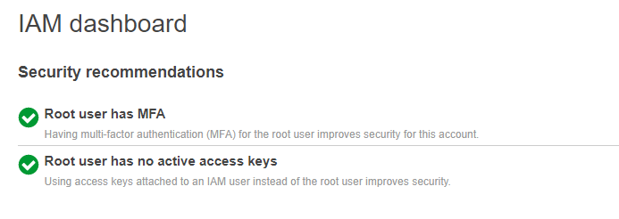

# Identity and Access Management (IAM)

## Task

1. Login on your AWS account
2. Activate Multifactor authentication for root user
3. Create a user who is an admin for the root user

## Solution

1. I logged in to my AWS account using my root user credentials.
2. I activated multifactor authentication for the root account 
   
   > Here is the result:
   

3. I created a user with admin policy 
   > Here is the result:
   