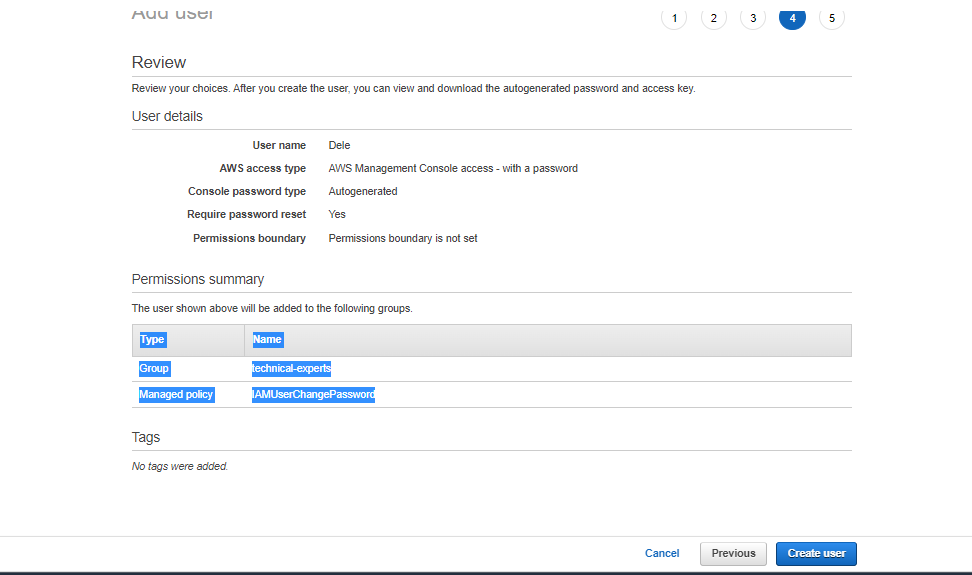

# Identity and Access Management (IAM)

## Task

In an organization demo.io, they have 5 people in different unit as listed:

i.   Dele     technical expert 

ii.  Ade      technical support

iii. Segun    Storage expert

iv.  Gbenga   Admin support

v. Sharon  Finance head

Your task in this lab is to create 

1. Groups and add the corresponding user
2. Enforce a password policy
3. Perform clean up operations

## Solution
1. I created 5 groups with names technicalexperts, technicalsupports, storageexperts, adminsupports and financehead
2. I created users Dele, Ade, Segun, Gbenga and Sharon and added them to their respective groups
   
   > Here is sample of one:
   

Guides:
https://docs.aws.amazon.com/IAM/latest/UserGuide/introduction.html
