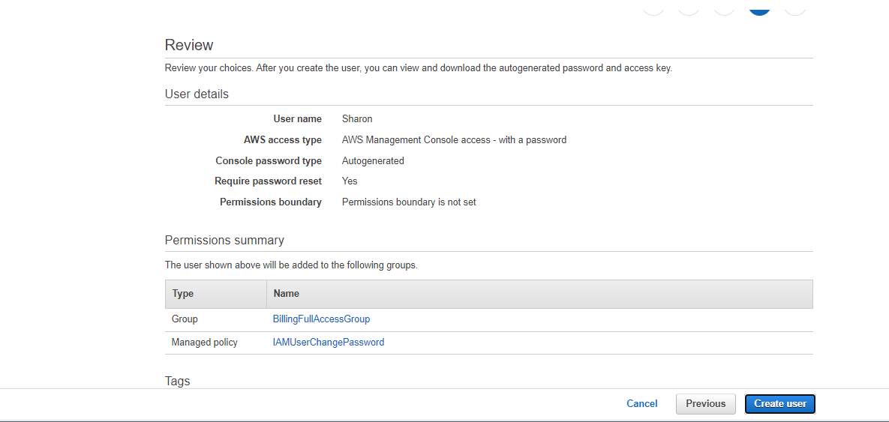
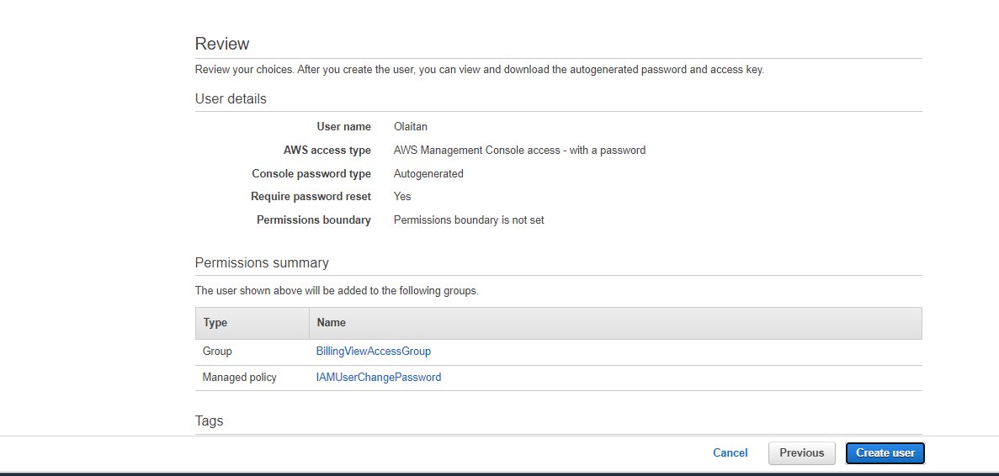

# Identity and Access Management (IAM)

## Working in Billing Unit

The image below shows two employee in the finance unit. They are to be granted workspace on AWS. 

Perform the following task as described on the attached image

Note:
At the end of the lab, you should perform clean up operations.

## Working in Billing Unit

1. I created a group named BillingFullAccess with policies to have full access to billings and a group named BillingViewAccess with policies to have read only access to billings

2. I created a user Sharon into BillingViewAccess group and user Olaitan into the BillingViewAccess group 
   
   > Here is preview:
   
   

Guides:

https://docs.aws.amazon.com/IAM/latest/UserGuide/tutorial_billing.html
