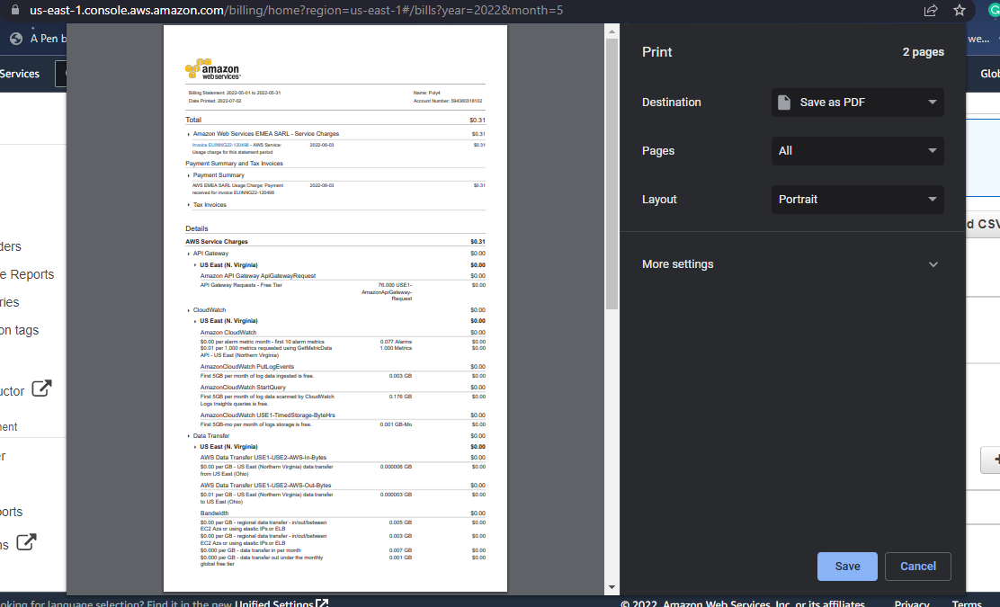

# Working with AWS Billing

## Tasks

1. Attach the required IAM policy to an IAM identity
2. Review your bills and usage
3. Email your Invoice
4. Download or print your bill

## Solution
1. I created a custom policy to allow billing access and add it to poly4 user
2. I opened up the billings services and reviews all my billings
3. I send the invoice to my mail
4. I download a pdf of the bill 
   
   > Here is a preview: 
   

Guide: 
https://docs.aws.amazon.com/awsaccountbilling/latest/aboutv2/billing-what-is.html
https://docs.aws.amazon.com/awsaccountbilling/latest/aboutv2/billing-getting-started.html