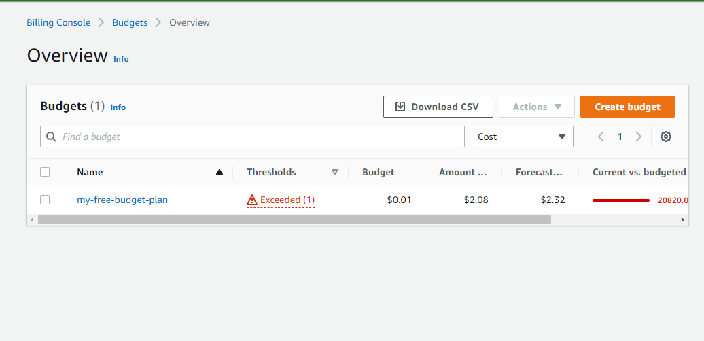
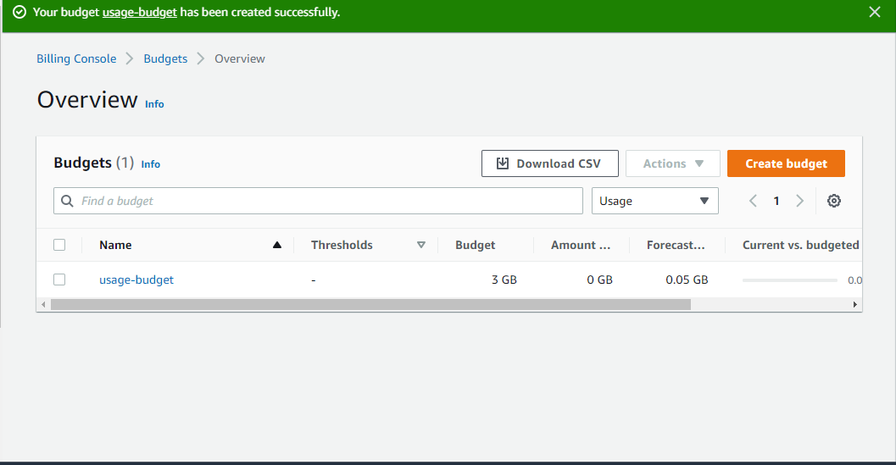

# AWS Free Tier usage alerts using AWS Budgets

## Task:

1. Create a cost budget
2. Create a usage budget

## Solution

1. I created a cost budget to monitor and alarm that alerts when my cost exceeds the limits specified
   > Here is a preview: 
   
2. I created a usage budget to monitor and alarm that alerts when my usage exceeds the limits specified
   > Here is a preview: 
   

NB: Include Budget alarm at your preferred threshold.

Guide:
https://docs.aws.amazon.com/cost-management/latest/userguide/budgets-create.html